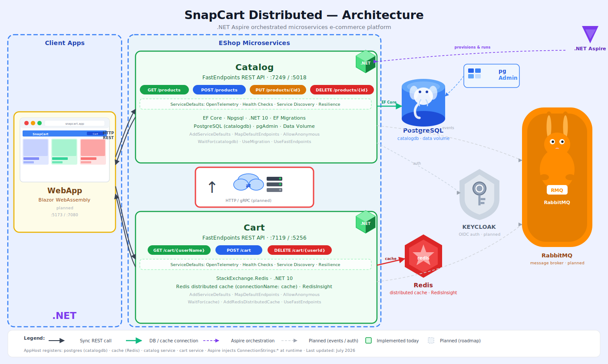

# SnapCart Distributed - Microservices E-commerce Platform



> **Diagram legend:** Solid, coloured nodes and edges are **implemented today** (AppHost, Catalog service, PostgreSQL + pgAdmin, ServiceDefaults). Faded, dashed nodes are **planned on the roadmap** (Blazor WebApp, Basket service, Redis, RabbitMQ, Keycloak). Regenerate with `dot -Tsvg architecture.dot -o architecture.svg` (source: [`architecture.dot`](./architecture.dot)).

## 📋 Overview

**SnapCart Distributed** is a modern, cloud-native e-commerce platform built using microservices architecture with .NET Aspire orchestration. It demonstrates enterprise-grade distributed system design patterns and best practices for building scalable, resilient applications.

## 🏗️ Architecture

### System Components

The platform consists of the following key components:

#### **Client Layer**
- **Blazor WebApp**: Modern interactive web application built with Blazor WebAssembly for real-time user experiences

#### **Microservices**
- **Catalog Service**: Manages product catalog, inventory, and product information
- **Basket Service**: Handles shopping cart operations and user basket management

#### **Infrastructure Services**
- **Keycloak**: OpenID Connect provider for authentication and authorization
- **RabbitMQ**: Asynchronous message broker for event-driven communication between services
- **PostgreSQL**: Primary relational database for persistent data storage
- **Redis**: In-memory cache for high-performance data access and session management

#### **Orchestration**
- **.NET Aspire**: Cloud-native application orchestration platform for managing and deploying microservices

## 🔧 Technology Stack

| Component | Technology | Purpose |
|-----------|-----------|---------|
| **Framework** | .NET 10.0 | Backend services and API development |
| **Orchestration** | .NET Aspire | Service orchestration and cloud-native deployment |
| **Frontend** | Blazor WebAssembly | Interactive web UI |
| **Database** | PostgreSQL | Primary data persistence |
| **Cache** | Redis | Session and data caching |
| **Message Broker** | RabbitMQ | Asynchronous event processing |
| **Authentication** | Keycloak | Identity and access management |
| **Communication** | HTTP/gRPC | Service-to-service communication |

## 📁 Project Structure

```
Snapcart-Distributed/
├── AppHost/                      # .NET Aspire orchestration host
│   ├── AppHost.cs
│   ├── AppHost.csproj
│   ├── appsettings.json
│   └── aspire.config.json
├── Catalog/                      # Catalog microservice
│   ├── Program.cs
│   ├── Catalog.csproj
│   ├── Models/
│   │   └── Product.cs
│   ├── appsettings.json
│   └── Catalog.http
├── Basket/                       # Basket microservice (planned)
│   └── [Coming soon]
├── ServiceDefaults/              # Shared service configuration
│   ├── Extensions.cs
│   └── ServiceDefaults.csproj
├── architecture.dot              # Graphviz architecture diagram source
├── architecture.svg              # Architecture diagram (SVG)
├── architecture.png              # Architecture diagram (PNG)
├── Snapcart-Distributed.sln      # Solution file
└── README.md                     # This file
```

## 🚀 Getting Started

### Prerequisites

- **.NET 10.0 SDK** or later
- **Docker** (for running infrastructure services)
- **Git**
- **Graphviz** (optional, for regenerating architecture diagrams)

### Installation

1. **Clone the repository**
   ```bash
   git clone https://github.com/GitItKrishna/SnapCart.git
   cd SnapCart
   ```

2. **Restore NuGet packages**
   ```bash
   dotnet restore
   ```

3. **Build the solution**
   ```bash
   dotnet build
   ```

### Running the Application

#### Using .NET Aspire (Recommended)

1. **Navigate to the AppHost project**
   ```bash
   cd AppHost
   ```

2. **Run the Aspire host**
   ```bash
   dotnet run
   ```

   The Aspire Dashboard will be available at `https://localhost:17360` (port may vary)

#### Individual Services

**Catalog Service:**
```bash
cd Catalog
dotnet run
```

The Catalog service will be available at `https://localhost:7200` (port may vary based on configuration)

### Infrastructure Setup

Before running services, ensure the backing services are available:

#### Using Docker Compose (Recommended)

Create a `docker-compose.yml` file in the root directory:

```yaml
version: '3.8'

services:
  postgres:
    image: postgres:15-alpine
    environment:
      POSTGRES_USER: snapcart
      POSTGRES_PASSWORD: snapcart_password
      POSTGRES_DB: snapcart_db
    ports:
      - "5432:5432"
    volumes:
      - postgres_data:/var/lib/postgresql/data

  redis:
    image: redis:7-alpine
    ports:
      - "6379:6379"

  rabbitmq:
    image: rabbitmq:3.12-management-alpine
    environment:
      RABBITMQ_DEFAULT_USER: guest
      RABBITMQ_DEFAULT_PASS: guest
    ports:
      - "5672:5672"
      - "15672:15672"

  keycloak:
    image: keycloak/keycloak:latest
    environment:
      KEYCLOAK_ADMIN: admin
      KEYCLOAK_ADMIN_PASSWORD: admin
      KC_DB: postgres
      KC_DB_URL: jdbc:postgresql://postgres:5432/keycloak
      KC_DB_USERNAME: keycloak_user
      KC_DB_PASSWORD: keycloak_password
    ports:
      - "8080:8080"
    depends_on:
      - postgres

volumes:
  postgres_data:
```

Then run:
```bash
docker-compose up -d
```

## 🔌 API Endpoints

### Catalog Service

- **Get all products**: `GET /api/catalog/products`
- **Get product by ID**: `GET /api/catalog/products/{id}`
- **Create product**: `POST /api/catalog/products`
- **Update product**: `PUT /api/catalog/products/{id}`
- **Delete product**: `DELETE /api/catalog/products/{id}`

### Basket Service (Coming Soon)

- **Get basket**: `GET /api/basket/{userId}`
- **Add to basket**: `POST /api/basket/{userId}/items`
- **Remove from basket**: `DELETE /api/basket/{userId}/items/{productId}`
- **Clear basket**: `DELETE /api/basket/{userId}`

## 🔐 Authentication

The platform uses **Keycloak** for centralized authentication and authorization. All microservices validate tokens issued by Keycloak.

### Default Credentials (Development Only)

- **Keycloak Admin URL**: `http://localhost:8080`
- **Username**: `admin`
- **Password**: `admin`

⚠️ **Note**: Change these credentials in production!

## 📊 Data Flow

1. **User Request**: Blazor WebApp sends a request to a microservice
2. **Authentication**: Request is validated against Keycloak
3. **Processing**: Microservice processes the request
4. **Async Events**: For long-running operations, events are published to RabbitMQ
5. **Caching**: Frequently accessed data is cached in Redis
6. **Persistence**: Data is stored in PostgreSQL
7. **Response**: Response is returned to the client

## 🏗️ Design Patterns

This architecture implements several important microservices patterns:

- **API Gateway Pattern**: Centralized entry point for client requests
- **Database per Service**: Each microservice has its own database
- **Event-Driven Architecture**: Asynchronous communication via RabbitMQ
- **Circuit Breaker**: Resilient inter-service communication
- **Cache-Aside Pattern**: Redis for performance optimization
- **Distributed Tracing**: Service observability and debugging

## 📈 Scaling Considerations

- **Horizontal Scaling**: Each microservice can be scaled independently
- **Load Balancing**: Use Kubernetes or cloud provider load balancers
- **Database Sharding**: PostgreSQL can be partitioned for large datasets
- **Cache Replication**: Redis Cluster for high availability
- **Message Queue Replication**: RabbitMQ clustering for fault tolerance

## 🧪 Testing

### Unit Tests
```bash
dotnet test
```

### Integration Tests
Ensure all backing services (PostgreSQL, Redis, RabbitMQ, Keycloak) are running:
```bash
dotnet test --configuration Integration
```

## 📝 Configuration

Configuration files are located in each service directory:

- `appsettings.json` - Production settings
- `appsettings.Development.json` - Development settings
- `aspire.config.json` - Aspire-specific configuration

### Environment Variables

```bash
# PostgreSQL
POSTGRES_CONNECTION_STRING=Server=localhost;Port=5432;Database=snapcart_db;User Id=snapcart;Password=snapcart_password;

# Redis
REDIS_CONNECTION_STRING=localhost:6379

# RabbitMQ
RABBITMQ_HOST=localhost
RABBITMQ_PORT=5672
RABBITMQ_USER=guest
RABBITMQ_PASSWORD=guest

# Keycloak
KEYCLOAK_URL=http://localhost:8080
KEYCLOAK_REALM=snapcart
KEYCLOAK_CLIENT_ID=snapcart-client
KEYCLOAK_CLIENT_SECRET=your-secret
```

## 🐛 Troubleshooting

### Services won't connect
- Ensure all backing services (PostgreSQL, Redis, RabbitMQ, Keycloak) are running
- Check connection strings in configuration files
- Review service logs for connection errors

### Authentication failures
- Verify Keycloak is running and accessible
- Check realm and client configuration
- Ensure tokens are being passed correctly in Authorization headers

### Performance issues
- Monitor Redis cache hit rates
- Check PostgreSQL query performance
- Review RabbitMQ message queue depths

## 🤝 Contributing

1. Create a feature branch: `git checkout -b feature/your-feature`
2. Commit your changes: `git commit -m 'Add your feature'`
3. Push to the branch: `git push origin feature/your-feature`
4. Submit a pull request

## 📄 License

This project is licensed under the MIT License - see the LICENSE file for details.

## 👨‍💼 Author

**GitHub**: [@GitItKrishna](https://github.com/GitItKrishna)

## 🎯 Roadmap

- [ ] Complete Basket microservice implementation
- [ ] Implement order processing service
- [ ] Add payment gateway integration
- [ ] Develop notification service
- [ ] Implement search and filtering
- [ ] Add product reviews and ratings
- [ ] Implement user profile management
- [ ] Deploy to Kubernetes
- [ ] Add comprehensive logging and monitoring
- [ ] Performance optimization and load testing

## 📞 Support

For issues, questions, or suggestions, please:
- Open an issue on GitHub
- Contact the development team

---

**Last Updated**: July 2026

